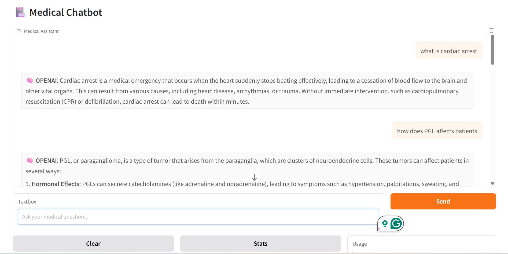
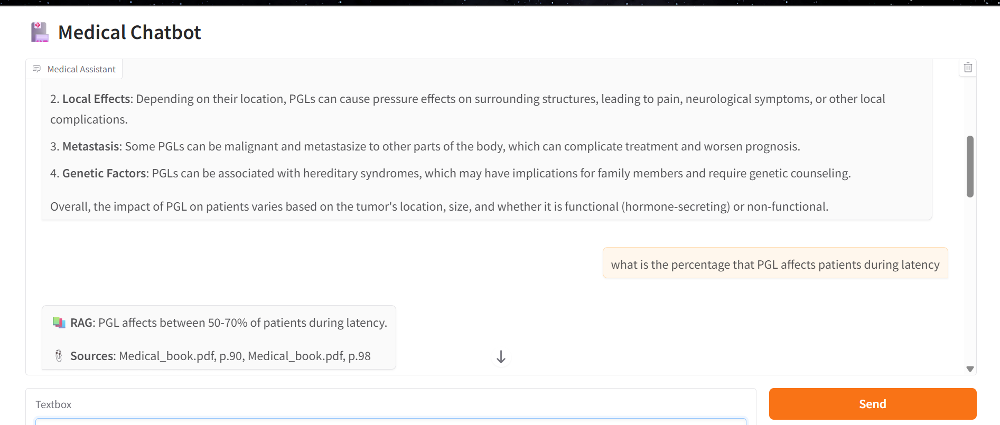
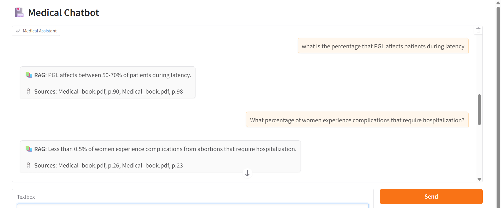

# 🏥 MedBot — Medical RAG Chatbot

A hybrid AI-powered medical chatbot built with OpenAI GPT-4o-mini and Retrieval-Augmented Generation (RAG). MedBot answers medical questions using a smart two-step approach: it first tries to answer directly from OpenAI's knowledge, and falls back to searching your uploaded medical PDF documents when needed — with page-level citations.

A Gemini-powered version of this chatbot is also available in this repository (`final_medibot_gemini.ipynb`), built using Google's Gemini model as an alternative LLM backend.

---

## 🖼️ Demo

**Gradio Web Interface**





**Command-Line Interface**


---

## ⚙️ How It Works

MedBot uses a **hybrid query strategy**:

1. **OpenAI First** — Sends the question directly to GPT-4o-mini. If the model is confident, it returns the answer immediately.
2. **RAG Fallback** — If OpenAI is uncertain, the question is routed to a ChromaDB vector database built from your uploaded medical PDFs. The most relevant chunks are retrieved and passed to the LLM for a grounded answer with source citations.
3. **Response Caching** — Repeated questions are served from an in-memory cache to avoid redundant API calls and reduce cost.

---

## 🧰 Tech Stack

| Component | Technology |
|---|---|
| LLM | OpenAI GPT-4o-mini |
| Embeddings | OpenAI text-embedding-3-small |
| Vector Database | ChromaDB |
| RAG Framework | LangChain (RetrievalQA) |
| PDF Processing | PyMuPDF |
| Web Interface | Gradio |
| Environment | Google Colab |

---

## 🚀 Getting Started

### 1. Clone the repo
```bash
git clone https://github.com/marthagracek/MedBot-Medical_-Assistant.git
cd MedBot-Medical_-Assistant
```

### 2. Open in Google Colab
Upload `finalmedibot_openai.ipynb` to [Google Colab](https://colab.research.google.com/).

### 3. Install dependencies
The notebook handles installation automatically. Key packages:
```
openai
langchain==0.2.16
langchain-openai==0.1.23
langchain-community==0.2.16
langchain-text-splitters==0.2.4
chromadb
PyMuPDF
gradio
```

### 4. Add your OpenAI API key
When prompted in the notebook, enter your OpenAI API key. You can get one at [platform.openai.com](https://platform.openai.com/).

### 5. Upload your medical PDFs
The notebook will prompt you to upload PDF files. These are processed, chunked, and stored in a ChromaDB vector database.

### 6. Start chatting
Use either the **command-line interface** or the **Gradio web interface** (with a public shareable link).

---

## 💬 Example Queries

| Query | Response Type |
|---|---|
| "What is cardiac arrest?" | 🧠 OpenAI |
| "What percentage of women experience complications requiring hospitalization?" | 📚 RAG + Sources |
| "What is the percentage that PGL affects patients during latency?" | 📚 RAG + Sources |
| "What are the causes of AIDS?" | 🧠 OpenAI |
| "When the CD4+ lymphocyte count falls below what number is a patient at risk?" | 🧠 OpenAI |

---

## 🤖 Gemini Version

A version of MedBot powered by **Google Gemini** is also included in this repository (`final_medibot_gemini.ipynb`). It follows the same hybrid RAG architecture but uses Gemini as the LLM backend instead of OpenAI — useful if you prefer Google's ecosystem or want to compare outputs between models.

---

## 📁 Project Structure

```
MedBot-Medical_-Assistant/
│
├── finalmedibot_openai.ipynb   # Main notebook (OpenAI version)
├── final_medibot_gemini.ipynb  # Gemini version
├── gradio_output1.png          # Demo screenshots
├── gradio_output2.png
├── gradio_output3.png
├── output1.png
├── output2.png
├── output3.png
└── README.md
```

---

## 🔒 Notes

- Your API key is stored only in the Colab session environment and is never saved to disk.
- The response cache is in-memory only and resets when the session ends.
- PDF documents are processed locally within the Colab environment.

---

## 👤 Author

**marthagracek** — [GitHub](https://github.com/marthagracek)
